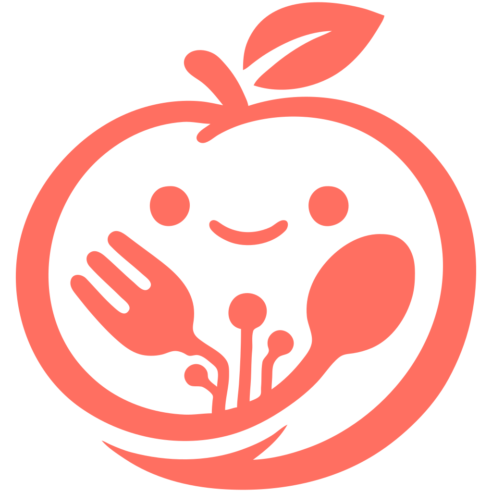

<div align="center">



# [NutriNutri](http://nutrinutri.popelis.sk/)

**Your Personal AI Nutritionist.**
_Simple. Private. Open Source. Not-for-profit._

[](LICENSE)
[](https://flutter.dev/)
[](http://nutrinutri.popelis.sk/)

</div>

---

[**NutriNutri**](http://nutrinutri.popelis.sk/) makes nutrition tracking feel effortless. Snap a photo of your meal (or just type what you ate in plain English) and let the AI handle the rest: ingredients, portions, calories, macros, all logged in seconds.

No endless food databases. No barcode hunting. No subscriptions. Just a tool that gets out of your way so you can focus on actually eating well.

> Health tools should be accessible to everyone and should respect your privacy. That's why NutriNutri is **non-profit**, **open source (GPLv3)**, and **privacy-first** — by design, not by marketing.

## ✨ What's inside

- **📸 AI Auto-Logging** Photograph your plate or describe your meal. The AI breaks it down into ingredients, estimates portions, and logs everything for you.
- **🥗 Full Nutrition Picture** Calories, protein, carbs, fats, fiber, sodium, caffeine, water, and more. Track what matters to *you*.
- **🏃 Activity Tracking** Log workouts and see calories burned alongside what you've eaten.
- **🔒 Privacy-First** Your health data is yours. No analytics, no tracking, no selling - ever.
- **📱 Runs Everywhere** Web, Android, Linux, macOS, and Windows. One app, every device.
- **💸 Free Forever** Bring your own [OpenRouter](https://openrouter.ai/) key and pay only for what you use. No middlemen, no markup.
- **❤️ Non-Profit & Open Source** Built in the open under GPLv3. No VC money, no dark patterns, no growth hacks.

## 🏁 Getting Started

### Prerequisites

- [Flutter SDK](https://flutter.dev/docs/get-started/install)
- [OpenRouter API Key](https://openrouter.ai/): needed for the AI features

### Run it locally

```bash
git clone https://github.com/riki137/nutrinutri.git
cd nutrinutri
flutter pub get
flutter run
```

### First-time setup

1. Open the app
2. Head to **Settings**
3. Paste your **OpenRouter API Key**

That's it, you're ready to log your first meal.

## 🚀 Roadmap

- [x] Activity tracking with calorie burn
- [x] Extended metrics (fiber, sodium, caffeine, water…)
- [ ] **UX polish** — repeated meals, quick stats, smoother flows
- [ ] **Charts & trends** — weekly and monthly insights into your intake
- [ ] **Recipe Builder** — AI-generated recipes tailored to your preferences, saved to your diary

Have an idea? [Open an issue](https://github.com/riki137/nutrinutri/issues). I'd love to hear it.

## 🛠️ Built With

- [**Flutter**](https://flutter.dev/) one codebase, every platform.
- [**OpenRouter**](https://openrouter.ai/) flexible access to the best models, on your terms.

## 🤝 Contributing

Pull requests, bug reports, and ideas are all welcome. This project belongs to everyone who wants better nutrition tools — that probably includes you.

## 📄 License

Released under the **GNU General Public License v3.0** — see [LICENSE](LICENSE) for the details.

In short: fork it, modify it, share it. Just keep it open, and please give credit where it's due.

---

<div align="center">

_Made with ❤️ for a healthier world._

[nutrinutri.popelis.sk](http://nutrinutri.popelis.sk/)

</div>
